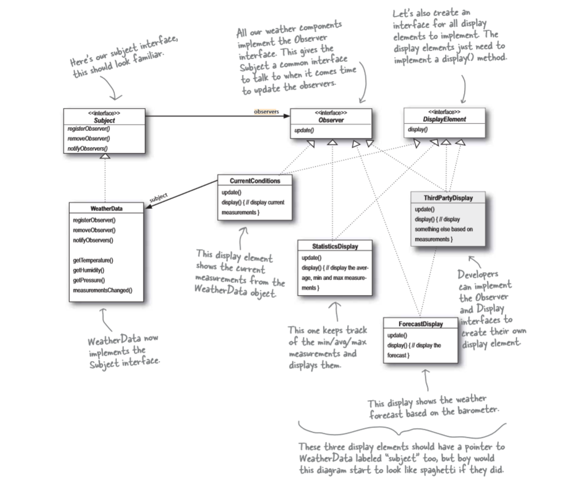

## Real world example for Observer Pattern
> Lets take the example of Newspaper or magazine Subscription service.

- A newspaper publisher goes into business and begins publishing newspaper.
- You Subscribe to a particular publisher and every time there's a new edition its gets delivered to you. As long as you remain a subscriber, you get new newspapers.
- You unsubscribe when you don't want papers anymore, and they stop being delivered.
- While the publisher remains in the business, people, hotels, airlines, and other businesses constantly subscribe and unsubscribe to the newspaper.

I think the above example will clearly explains the concept of observer patterns where we are consider `News Paper Publisher` as the observer which will observe `You` as the subscriber of the news paper service.

## Intent
- Define a one-to-many dependency between objects so that when one object changes state, all its dependents are notified and updated automatically.
- Encapsulate the core (or common or engine) components in a Subject abstraction, and the variable (or optional or user interface) components in an Observer hierarchy.
- The "View" part of Model-View-Controller.

## Problem
A large monolithic design does not scale well as new graphing or monitoring requirements are levied.

## Discussion
Define an object that is the "keeper" of the data model and/or business logic (the Subject). Delegate all "view" functionality to decoupled and distinct Observer objects. Observers register themselves with the Subject as they are created. Whenever the Subject changes, it broadcasts to all registered Observers that it has changed, and each Observer queries the Subject for that subset of the Subject's state that it is responsible for monitoring.

This allows the number and "type" of "view" objects to be configured dynamically, instead of being statically specified at compile-time.

The protocol described above specifies a "pull" interaction model. Instead of the Subject "pushing" what has changed to all Observers, each Observer is responsible for "pulling" its particular "window of interest" from the Subject. The "push" model compromises reuse, while the "pull" model is less efficient.

Issues that are discussed, but left to the discretion of the designer, include: implementing event compression (only sending a single change broadcast after a series of consecutive changes has occurred), having a single Observer monitoring multiple Subjects, and ensuring that a Subject notify its Observers when it is about to go away.

The Observer pattern captures the lion's share of the Model-View-Controller architecture that has been a part of the Smalltalk community for years.

## Structure
Subject represents the core (or independent or common or engine) abstraction. Observer represents the variable (or dependent or optional or user interface) abstraction. The Subject prompts the Observer objects to do their thing. Each Observer can call back to the Subject as needed.

-- image --

## Example
**Weather Station**

We're going to start out implementation using the class diagram that is mentioned above. In this example you will learn how to create your own observer pattern.
