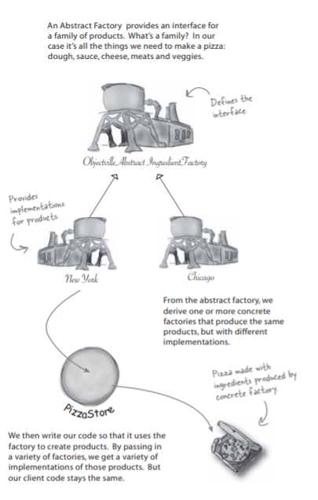

# Abstract Factory
`Book Definition`: The Abstract Factory Pattern provides an interface for creating families of related or dependent objects without specifying their concrete classes.

`My Definition`: Abstract factory pattern allows clients(in our case NYStylePizzaFactory) to use an abstract interface to create a set of relative(similar) products(like NYStyleCheesePizza) without actually knowing actual products that are actually produced.

## Problem
I have a successful Pizza Stores so far but, I received some complaints on the quality of pizza produced by `NYStylePizzaFactory`. After investigating this issue, I found they are using low-quality ingredients for preparing pizza which they acquire from the local market place. This problem leads me to a situation where I need to find a solution to monitor and maintain my quality of ingredients that my franchises use for creating pizzas. So I read my Design Pattern Bible `Head First Design Pattern`.

So I found my solution with `Abstract Factory Pattern` this helped me to create an `Ingredients Factory` that will provide the ingredients for `NYStylePizzaFactory` and `ChicagoStylePizzaFactory`. Which I have implemented later in this article.

## Solution
That's fairly complicated class diagram to draw; let's look at it all in terms of our PizzaStore:

What I have done?

### Code Implementation

