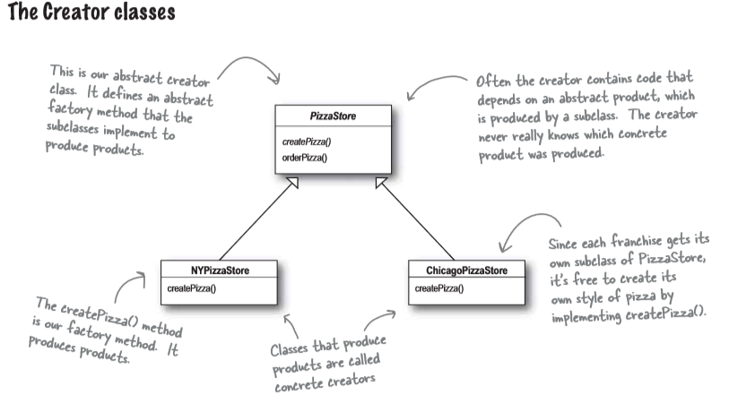
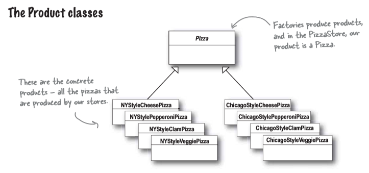

# Creational - Factory Method Pattern
Factory method pattern encapsulates object creation by letting subclasses decide what object to create. Here is the class diagram showing how this pattern works:




> This self explanatory UML diagram is the example stated in [Head First Design Pattern](https://www.amazon.in/Head-First-Design-Patterns-Brain-Friendly/dp/9352132777/ref=sr_1_1?s=books&ie=UTF8&qid=1548777791&sr=1-1&keywords=head+first+design+patterns).

## Problem Statement
Hello guys, I am glad that you have followed my story with my `Simple Pizza Factory`, I have earned huge success and got offers to start franchises of my Pizza Store in `New York` and `California`.

Before modifying my code for these franchises, I want to list out my `quality control rules` and `cost calculation` as I don't want them to misuse my name by not maintaining the quality that I give to my customers, and also I want them to feel free for taking orders and inventing pizza based on the competition.

### Franchises Requirements
- I want all the franchise pizza store to leverage my PizzaStore code, so that pizzas are prepared in the same way.
- NY style pizza will have thin crust, tasty sauce and little cheese. (based on the requirements)
- Chicago style pizza will have thick crust, rich sauce and tons of cheese. (based on the requirements)
- Need to control quality control to prevent mistake in Cutting and Boxing pizza.
  
## Solution
There is a way to localize all the pizza making activities in the pizza store.
First, lets look into the changes in the `Pizza Store`:
```C#
// PizzaStore is now abstract which will help to control process
public abstract class PizzaStore {
    public Pizza OrderPizza(string type){
        Pizza pizza;
        pizza = createPizza(type);
    }
}
```