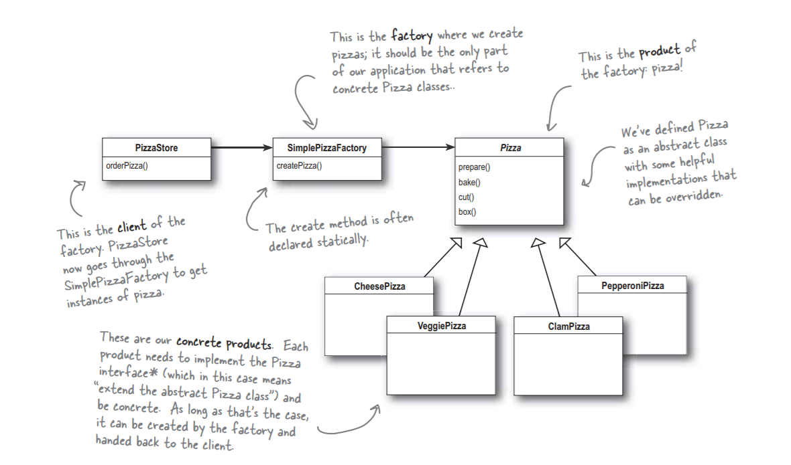

# The Simple Factory
The Simple Factory isn't actually a Design Pattern; it's more of a programming idiom. Some developers do mistake this idiom for the "Factory Pattern," so the next time there is an awkward silence between you and another developer, you've got a nice topic to break the ice.

This is a UML diagram shown in [Head First Design Pattern](https://www.amazon.in/Head-First-Design-Patterns-Brain-Friendly/dp/9352132777/ref=sr_1_1?s=books&ie=UTF8&qid=1548777791&sr=1-1&keywords=head+first+design+patterns) :



This is a self explanatory diagram of Simple Factory idiom.

## Problem Statement

So I want to start my Pizza Store and when want my store to have four types of pizza shown in the UML diagram shown on the above image. But since I don't have the knowledge of design patterns I have created my store as shown below: 

I think this will be the default approach that most of the developers use for creating their pizza store:

``` c#
public Pizza OrderPizza(string type)
{
    Pizza pizza;
    // This is wrong to specify pizza creational logic within orderPizza() method.
    // we need to move this somewhere else lets discuss that below.
    if(type == "CheesePizza")
        pizza = new CheesePizza();
    else if(type == "VeggiePizza")
        pizza = new VeggiePizza();
    else if(type == "ClamPizza")
        pizza = new ClamPizza();
    else if(type == "PepperoniPizza")
        pizza = new PepperoniPizza();
    else
        pizza = new CheesePizza();
    // ----------

    pizza.prepare();
    pizza.bake();
    pizza.cut();
    pizza.box();

    return pizza;
}
```
But being a Software Developer, I wanted my store to be more loosely coupled as time passes I will have more competitions in my region. So if I want to add or remove any pizza I have to update my `OrderPizza` method all the time. So what can I do with this code.

So, where can I move this code from here.
> `Move in the new Method` : Moving this login to a new method will not solve the problem with this method as according to the SRP(Single Responsibility Principle) we should move the logic in its own class. Since the role of `OrderPizza` is to take Orders not create the order.
  
So, how I have solved this problem, I have created my store class `PizzaStore` and given it the responsibility to take orders based on the type of pizza, I have also injected my `PizzaFactory` class that will help my store to create pizza using my factory. My `PizzaFactory` will take the type of the pizza and using `IPizza` interface it will prepare, bake, cut and box the pizza and send it to `PizzaStore`.

So, Lets see how it looks:

```
- PizzaStore.cs
- PizzaFactory.cs
- PizzaModel
    IPizza.cs
    - Types
        - CheesePizza.cs
        - VeggiePizza.cs
        - ClamPizza.cs
        - PepperoniPizza.cs
```

So, with this model when ever we have any update in the menu item, we will update the factory and the store will not be effected.

Lee me show you how my pizza store look like:
```
$ cd SimpleFactory
$ dotnet build
$ dotnet run
Welcome to my Pizza Store!
Please enter your pizza type from
(Cheese)(Veggie)(Clam)(Pepperoni)
Cheese

Preparing Cheese Pizza
Backing Cheese Pizza
Cutting Cheese Pizza
Boxing Cheese Pizza

Thank for Ordering SimpleFactory.PizzaModel.Types.CheesePizza please collect your order from front desk in 15 min.
```
Hurray! My pizza store is looking great now and I am getting a lot of profit from it.

Now, my store is going popular and I want to start franchises in the next town to increase my profit. I will update my current architecture with `Factory Method Pattern` and introduce the cost calculator to calculate pizza cost based on item used. To understand how I have expended my store app follow my next design pattern.

[Factory Method Pattern](../Creational_FactoryMethod/README.md)